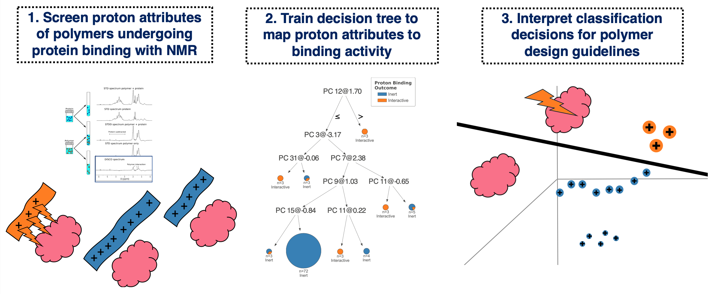

## INFRNO: Interpretable framework for uncovering interaction opportunities in macromolecules

#### <b>Samantha Stuart, Jeffrey Watchorn, Frank Gu</b>
#### Institute of Biomedical Engineering, University of Toronto, Toronto, Ontario, Canada
#### Department of Chemical Engineering and Applied Chemistry, University of Toronto, Toronto, Ontario, Canada
<br>
This formal analysis repository accompanies the work: An Interpretable Machine Learning Framework for Modelling Macromolecular Interaction Mechanisms with Nuclear Magnetic Resonance.
<br>
<br>

<br>
<br>
In this work, we developed a framework for modelling the interactions that result between large molecule systems to inform biomaterial design. In addition to modelling structure-activity, the framework identifies "undervalued" ligand sites as engineering design opportunities to unlock receptor interaction. 

The input data and feature descriptors are obtained from experimental screening with [DISCO-NMR](https://pubs.acs.org/doi/10.1021/acs.biomac.1c00944). Any receptor-ligand interaction dataset generated from DISCO-NMR screening can be analyzed equivalently with INFRNO.

Using INFRNO, we can:  <br>
<ul>
<li><b>Model Atomic-Level Macromolecular Interaction Trends:</b> 
We apply linear principal component analysis to DISCO NMR data descriptors and labels, and train a binary decision tree classifier to construct proton structure-interaction trends across ligand chemical species. DISCO NMR data descriptors are:

* proton NMR chemical shift 
* proton cumulative DISCO Effect 
* parent polymer molecular weight 
* "cohort" chemical shift fingerprints that chemically contextualize the surroundings of the subject proton using global ligand composition
* Interaction label is computed from binarizing proton DISCO AF0
<br>
<li><b>Identify Opportunities for Designed Interaction:</b> Inert-labeled protons bordering cross-species decision regions indicate opportunities for physical property tuning towards interaction without additional chemical functionalization. <br>
<li><b>Create a runway to interaction prediction:</b> The decision tree for a given receptor can be re-trained to "grow" as increasingly diverse ligands are screened, while informing ligand design  with data-driven insights along the way.   
<br>
</ul>

## Quick Start on Google Colab:
To get quick intuition for the framework [we provide a tutorial in Google Colab](https://colab.research.google.com/drive/1Rq0_pN2wg_utzwcW2BMBC6xQ1mE-A7IA?usp=sharing) which can be run without any local environment setup.

The input dataset to upload to the Colab notebook can be downloaded from this repository in:
```data/raw/proton_binding_dataset.xsx```
## Running the Code Locally:
### Clone or download this GitHub repository:
Do one of the following:

* Clone this repository to a directory of your choice on your computer using the command line or GitHub Desktop.
* Download the ZIP file of archive of the repository, move and extract it in the directory of your choice on your computer.
* Open files in your development environment of choice [(ex: VSCode)](https://code.visualstudio.com/download)

### Install dependencies via Anaconda:
1. Download and install [Anaconda](https://conda.io/docs/index.html).
1. Navigate to the project directory.
1. Open Anaconda prompt in this directory (or Terminal)
1. Run the following commend from Anaconda prompt (or Terminal) to automatically create an environment from the requirements.txt file: `$ conda create --name infrno --file requirements.txt`
1. Run the following command to activate the environment: `conda activate infrno` 

For detailed information about creating, managing, and working with Conda environments, please see the [corresponding help page](https://conda.io/docs/user-guide/tasks/manage-environments.html).

### Install dependencies with pip

If you prefer to manage your packages using pip, navigate in Terminal to the project directory and run the command below to install the preqrequisite packages into your virtual environment:

```
$ pip install -r requirements.txt
```

### How to cite
```
@article{TBD,
  title={An Interpretable Machine Learning Framework for Modelling Macromolecular Interaction Mechanisms with Nuclear Magnetic Resonance},
  author={Stuart, Samantha and Watchorn, Jeffrey and Gu, Frank},
  journal={TBD},
  year={2022},
  publisher={TBD}
}
```

### License
MIT License