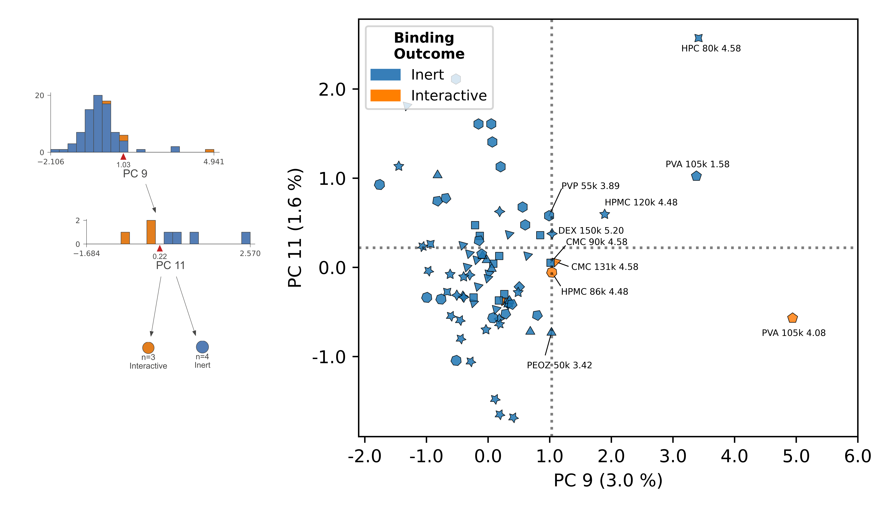

## INFRNO: Interpretable framework for uncovering interaction opportunities in macromolecules

#### <b>Samantha Stuart, Jeffrey Watchorn, Frank Gu</b>
#### Institute of Biomedical Engineering, University of Toronto, Toronto, Ontario, Canada
#### Department of Chemical Engineering and Applied Chemistry, University of Toronto, Toronto, Ontario, Canada
<br>
This formal analysis repository accompanies the work: <i> An Interpretable Machine Learning Framework for Modelling Macromolecular Interaction Mechanisms with Nuclear Magnetic Resonance.</i>

<br>


In this work, we developed a framework for modelling the interactions that result between large molecule systems to inform biomaterial design. In addition to modelling structure-activity, the framework identifies "undervalued" ligand sites as engineering design opportunities to unlock receptor interaction. The input data and feature descriptors are obtained from experimental screening with [DISCO-NMR](https://pubs.acs.org/doi/10.1021/acs.biomac.1c00944). Any receptor-ligand interaction dataset generated from DISCO-NMR screening can be analyzed equivalently with INFRNO.

--------

Using INFRNO, we can:  <br>
<ul>
<li><b>Model Atomic-Level Macromolecular Interaction Trends:</b> 
We apply linear principal component analysis to DISCO NMR data descriptors and labels, and train a binary decision tree classifier to construct proton structure-interaction trends across ligand chemical species. 
<br>

<li><b>Identify Opportunities for Designed Interaction:</b> Inert-labeled protons bordering cross-species decision regions indicate opportunities for physical property tuning towards interaction without additional chemical functionalization. 
<br>

<br>

<li><b>Create a runway to interaction prediction:</b> The decision tree for a given receptor can be re-trained to "grow" as increasingly diverse ligands are screened, while informing ligand design  with data-driven insights along the way.   
<br>
</ul>

--------
## Quick Start on Google Colab:
To get quick intuition for the framework [we provide a tutorial in Google Colab](https://colab.research.google.com/drive/1Rq0_pN2wg_utzwcW2BMBC6xQ1mE-A7IA?usp=sharing) which can be run without any local environment setup.

The input dataset to upload to the Colab notebook can be downloaded from this repository in:
```data/raw/proton_binding_dataset.xlsx```

--------
## Project Organization
    ├── LICENSE
    ├── README.md          <- The top-level README for this project.
    ├── data
    │   ├── processed      <- The benchmarking result files output from scripts
    │   └── raw            <- The training dataset
    │
    ├── notebooks          <- Notebooks and scripts for formal analysis
    │   ├── benchmark_CDEpipe.py         <- Benchmarking script for cumulative  
    │   │                                   disco effect pipeline
    │   ├── benchmark_maxsteadyslope.py  <- Benchmarking script for curve attribute 
    │   │                                   pipeline
    │   ├── benchmark_meandiscoeff.py    <- Benchmarking script for mean disco effect 
    │   │                                   pipeline
    │   ├── benchmark_chemonly.py        <- Benchmarking script for pipeline without 
    │   │                                   disco effect
    │   ├── benchmarking_analysis.ipynb  <- Global pipeline benchmarking analysis (SI)
    │   ├── final_model_paper_CDE_rs148.ipynb  <- Formal analysis and figure generation
    │   └── utils                        <- Utility functions
    │       └── feature_generation.py    <- DISCO NMR feature generation script
    │
    ├── figures           
    │   ├── main           <- Main formal analysis figures
    │   ├── misc           <- Misc. figure files
    │   └── supplementary  <- SI figures
    │
    └── requirements.txt   <- The requirements for the analysis environment
--------
## Setup to run the code locally:
### 1. Clone or download this GitHub repository:
Do one of the following:

* Clone this repository to a directory of your choice on your computer using the command line or GitHub Desktop.

* Download the ZIP file of archive of the repository, move and extract it in the directory of your choice on your computer.

### 2. Install dependencies using Anaconda or Pip
### Instructions for installing dependencies via Anaconda:
1. Download and install [Anaconda](https://conda.io/docs/index.html)

1. Navigate to the project directory

1. Open Anaconda prompt in this directory (or Terminal)

1. Run the following commend from Anaconda prompt (or Terminal) to automatically create an environment from the requirements.txt file: `$ conda create --name infrno --file requirements.txt`

1. Run the following command to activate the environment: `conda activate infrno` 

1. You are now ready to open and run files in the repository in a code editor of your choice that runs your virtual environment [(ex: VSCode)](https://code.visualstudio.com/download)

For detailed information about creating, managing, and working with Conda environments, please see the [corresponding help page](https://conda.io/docs/user-guide/tasks/manage-environments.html). 

### Instructions for installing dependencies with pip

If you prefer to manage your packages using pip, navigate in Terminal to the project directory and run the command below to install the preqrequisite packages into your virtual environment:

```
$ pip install -r requirements.txt
```

With either install option, you may need to create an additional Jupyter Notebook kernel containing your virtual environment, if it does not automatically appear. [See this guide for more information.](https://towardsdatascience.com/get-your-conda-environment-to-show-in-jupyter-notebooks-the-easy-way-17010b76e874)

--------
### 3. Run the model

1. Navigate to the notebook `notebooks/final_model_paper_CDE_rs148.ipynb` 

2. Execute all cells sequentially

### 4. Run the benchmarking

1. Execute each benchmarking script in `notebooks`
    * benchmark_CDEpipe.py
    * benchmark_chemonly.py
    * benchmark_maxsteadyslope.py
    * benchmark_meandiscoeff.py

2. Open `notebooks/benchmarking_analysis.ipynb`

3. Execute all cells sequentially to compare pipelines
--------
## Re-using repository with new dataset
1. Replace training dataset in `data/raw` with any new DISCO NMR screening results named `proton_binding_dataset.xlsx`. The name `proton_binding_dataset` must be preserved to maintain compatibility with all file read operations in this repository

2. Open `notebooks/final_model_paper_CDE_rs148.ipynb`, re-run all cells for file reading, feature generation, and model generation until updated tree figures are generated and displayed in the console
    * adjustment of hyperparameter grid and random seed may be required for new datasets to yield the best tree

3. To interpret the resulting tree decisions, customize the provided exemplary figure generation cells, and proton average properties, according to updated high importance principal components and decision rules

4. Where cross-polymer decision rules result, examine identities of inert protons near the interactive border as "hypotheses" for physical property tuning towards achieving interaction

5. If desired, execute `benchmark_CDEpipe.py` script to evaluate the out of sample error of the updated model for the updated dataset
    * Note that if the hyperparameter grid and random seeds have been altered, the benchmarking script should be equivalently adjusted to reflect updates
    * The majority classifier baseline F1 score should also be updated in accordance with new datasets


## How to cite
```
@article{TBD,
  title={An Interpretable Machine Learning Framework for Modelling Macromolecular Interaction Mechanisms with Nuclear Magnetic Resonance},
  author={Stuart, Samantha and Watchorn, Jeffrey and Gu, Frank},
  journal={TBD},
  year={2022},
  publisher={TBD}
}
```

## License
MIT License